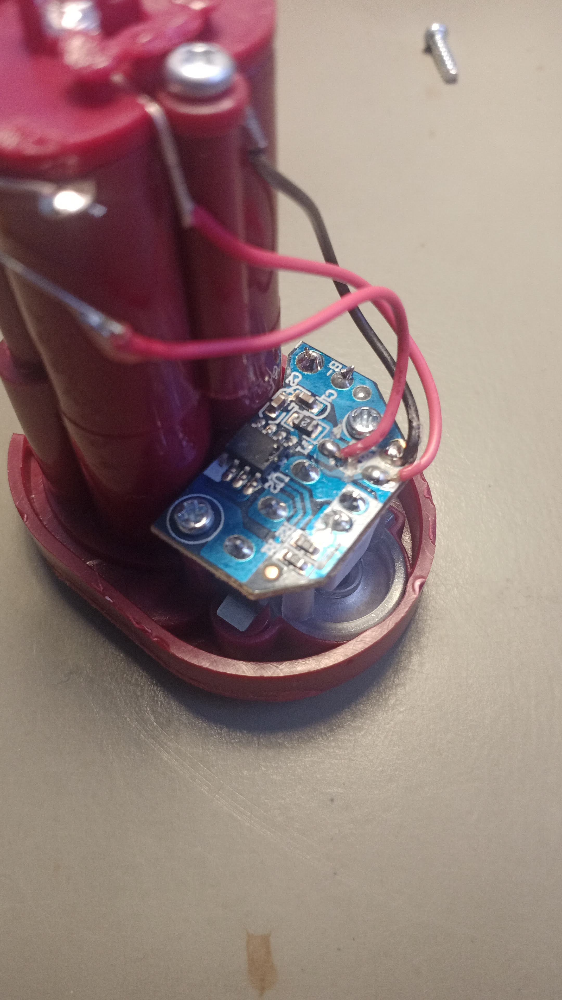
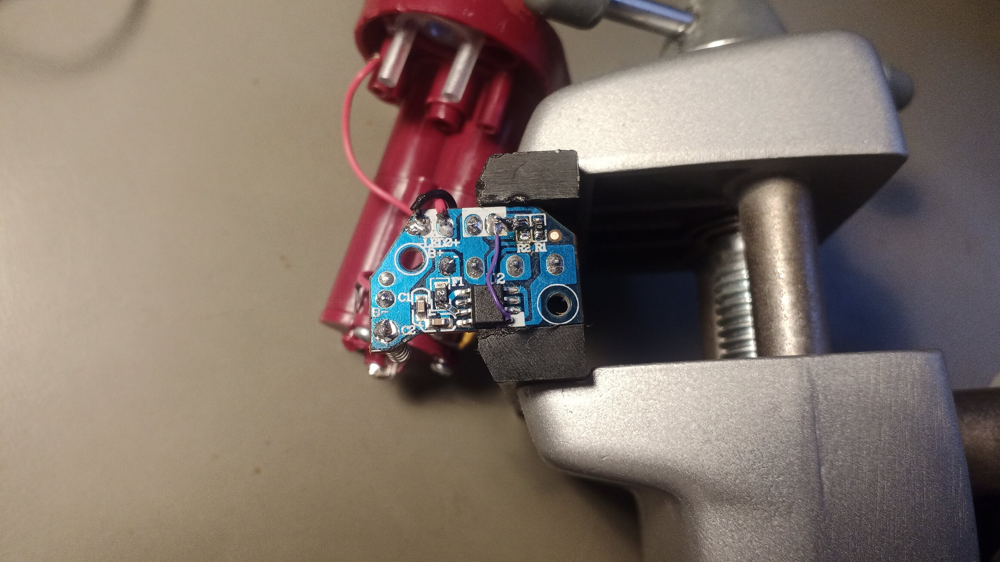

Firmware upgrade for the [GoGlow 14314 Harry Potter Hedwig Lamp](https://www.moosetoys.com/fr/our-toys/goglow-fr/harry-potter-hedwig-veilleuse-et-lampe-torche-goglow-buddy/).

## Introduction
The GoGlow 14314 Harry Potter Hedwig Lamp is a cute little lamp that can be used as a night light.  It has two LEDs.  One is on the bottom and lights when the lamp is picked up.  The other one is inside the owl and lights when the lamp is standing upright.

This is all well and good, but there's no way to turn off the light when you want it to.  You have to wait for 10mins for the light to turn off by itself.  This is not ideal if you want to use it as a night light for a child.

## Original design

The original design is based on an unknown microcontroller.  The laser engraving of the microcontroller has been removed. 

### Connections to the MCU
* Pin 1 : VCC
* Pin 3 : normally closed momentary switch to ground.  The switch is closed when the lamp is picked up.
* Pin 6 : UPDI and connected to the bottom LED (cathode of the LED to GND)
* Pin 7 : connected to the top LED (cathode of the LED to GND)
* Pin 8 : GND

### Power consumption at VCC=4.5V
* Bottom LED on : 18.2mA
* Top LED on : 18.13mA
* Both LEDs off : 11.5µA (Probably the switch is closed in this case.  I'm not sure.)

### Peculiarities
* There's a polyfuse on the PCB, but there's also one in the wire connecting the battery to the PCB.  Probably the polyfuse on the PCB was not suitable.
* The MCU's VCC line is decoupled with two capacitors in series.  That's very odd.  

## Patching

### Patch 0 : Replace MCU with ATTINY402
The unknown MCU has its VCC and GND-rails on the same pin numbers as an ATTINY402.  The PCB has a testpad connected to the MCU's pin 6, which is the UPDI pin on an ATTINY402.  

Is the original MCU an ATTINY402?  I tried reading the signature bytes, but that failed.  I later found out that the LED on the UPDI pin prevented me from reading the signature bytes.  As I was more interested in fixing the light than doing forensics, I didn't retry without the LED.  

When reusing the UPDI-pin for other functionality, a 12V-programmer is probably needed.  I didn't want to dig into that.  I decided to replace the MCU with an ATTINY402. 

### Patch 1 : BOTTOM_LED driven by pin 5 instead of pin 6
If I replace the MCU with an ATTINY402, the UPDI-pin will also be used to drive the bottom LED.  That makes things unnecessarily complicated, because pin 2, 4 and 5 are unused.

I decided to drive the bottom LED with pin 5 instead of pin 6.  This way I can use the UPDI-pin (pin 6) to reprogram the MCU.  I removed R2 and connected the anode of the bottom LED to pin 5 of the MCU.

### Patch 2 : External pull-up for momentary switch
I started by using the internal pull-up resistor in pin 3 of the MCU.  When the lamp is standing upright, the switch is open and there's no leakage current to ground.  When the lamp is lying on its side, a 150µA(!) current flows through the switch to ground.  The internal pull-up resistor is only between 20kohm and 50kohm.  
To reduce the standby current, in the event that the lamp is lying on its side, I added an external 3Mohm pull-up resistor to VCC and disabled the internal pull-up resistor.

# Firmware
The firmware is written in C and compiled with avr-gcc, using PlatformIO.  No fuse settings are needed.

## Functionality
If the lamp is put down shortly after picking it up (or vice versa), the light will turn off immediately.  If the lamp is put down and stays down, or the lamp is picked up and not put down, the light will turn off after 3 minutes.

## Power consumption
1. The LEDs are driven with PWM to reduce the power consumption.  That's probably also done in the original MCU.
2. The MCU is clocked at 32kHz.
3. When the LEDs are put off, the MCU goes to power down mode, reducing the current consumption to 0.5µA (standing upright) or 2.0µA (lying on its side).

----
The original repository can be found at [github](https://github.com/LieBtrau/goglow-14314-hedwig-firmware).